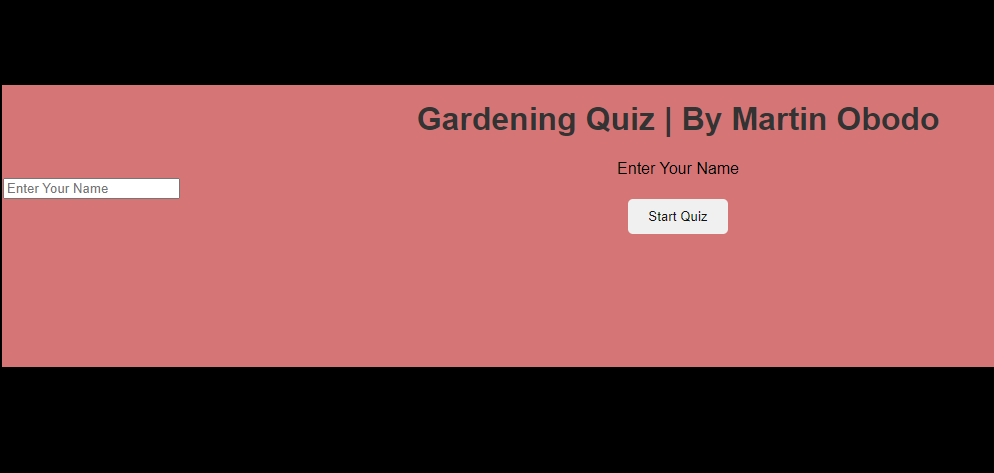
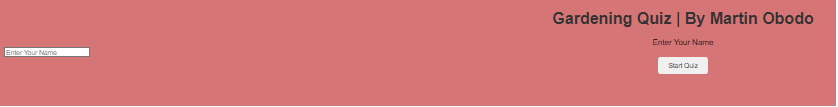
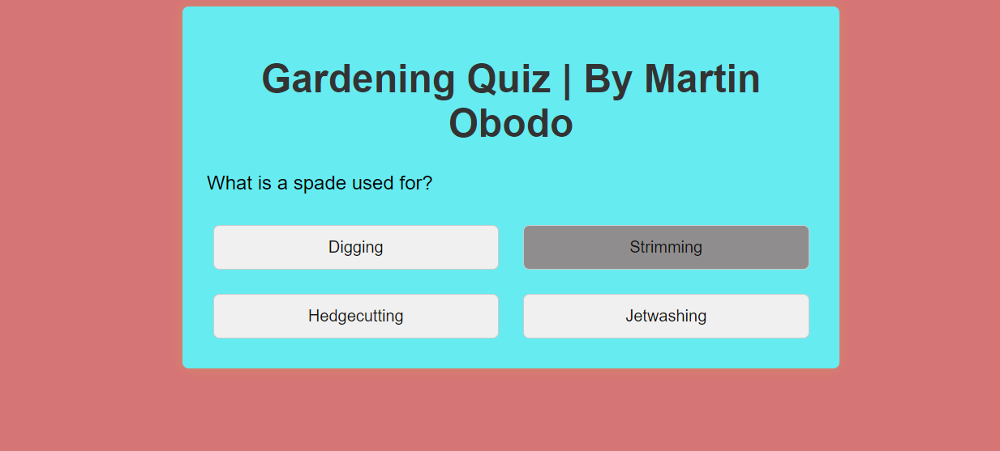
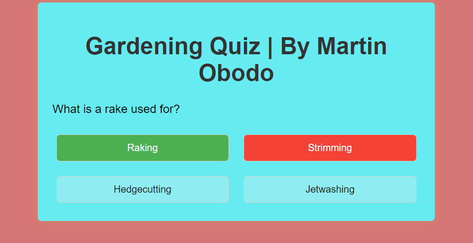
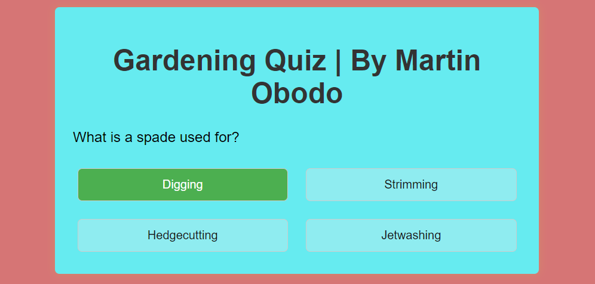
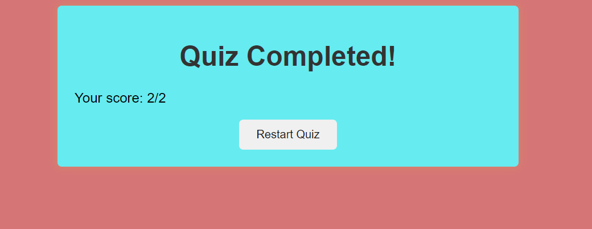

# link to the website
        https://martinobodo.github.io/Gardening-Quiz-2/

        # Table of Contents  

        ### Goal
 - Creating a quiz game involves setting clear goals to ensure the game is engaging, educational, and enjoyable for players. 
   Here are some key goals to consider when creating a quiz game:
   - Engagement: Make sure the game is enjoyable and captivating to maintain player interest.
   - Educational Value: Offer insightful and educational content to expand players' knowledge.
   - Challenge: Adjust the difficulty to offer a satisfying challenge without becoming overly frustrating.
  

### User Stories
- As a user:
   - I want to easily understand the purpose of the site.
   - I want to understand how to play the game.
   - I want to easily start the game by just entering my name or any other player's name.
   - I want to play the game again if I get a high or low score.
 
   
 ### Rules
  - In this game, the first step is to enter your name.The player should enter their name. Once you've done that, you'll proceed to the next page where you can start answering questions. A timer will be active, giving you 15 seconds to answer each question. If you don't answer within the time limit, the current question will disappear, and the next question will be displayed automatically, the player will receive the score after going through all 10 questions.
 
## Features
### Existing Features
##### Main page
 - The background is a pinky red colour 

- Header
    - Featured at the top of the page, the header shows the game name Interactive Gardening Quiz

    - A header that clearly tells the user what game they are playing
- Start the game
    - here is the part where can player type their name to enter the game.
   

#### second page
   - After the player logs in then questions will appear, when the player selects an option, they will get the question right or wrong,
     the game will move on to the next question automatically.
     
   
   - After the player makes a choice, the answer will be highlighted with a green background if correct, or a red background if incorrect. Then, the button will appear 'Next'
   - allowing them to proceed to the following question.
    
     
     

    - Once the player goes through all questions, the player has the option to restart the quiz. 
    

### Wireframe for mobile 
   incomplete

### iPad wireframe for all pages from the main page to the result page. 
   -incomplete

- My website has same the structure for all kinds of devices.
    

 ## Page test
 - HTML 
     untested
- CSS 
   
    untested
- JavaScript

   untested

- Lighthouse test

  untested

## Technologies used

   - HTML for the contents and structure of the website.
   - CSS for the styling.
   - GitPod as a local IDE & repository.
   - GitHub Pages to deploy the website.
   - Chrome Developer Tools for testing screen sizes and using 
    Lighthouse.
   - JS functions and examples.

    
 ## Unfixed Bugs
 - Restart quiz button does not work 

 ## Deployment
    
- The site was deployed to GitHub pages. The steps to deploy are as follows:
  - In the GitHub repository, navigate to the Settings tab
  - From the source section drop-down menu, select the Master Branch
  - Once the master branch has been selected, the page will be automatically refreshed with a detailed ribbon display to indicate the successful deployment.

 ## Credits
  - Dick Vlaanderen my mentor.
  - Instructions on how to build the quiz including codes, were in taken from this tutorial
    [>https://medium.com/@codepicker57/building-an-interactive-quiz-with-html-css-and-javascript-efe9bd8129e2<]
  - Used chatgpt for debugging. 
  ## Content
  - Favicon I created myself manually 
   
   
  
  ## Media
  - Colours used were from web tutorial 

## Update on Project information
- This is a simple project 
